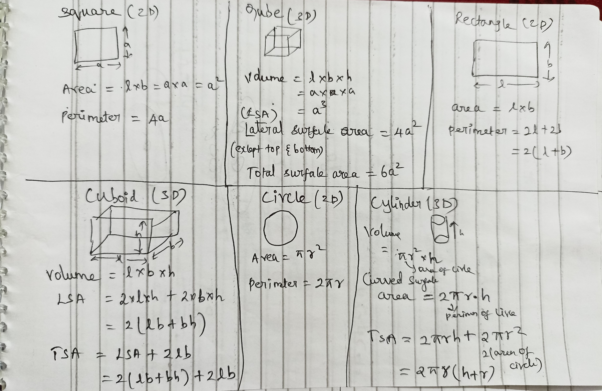
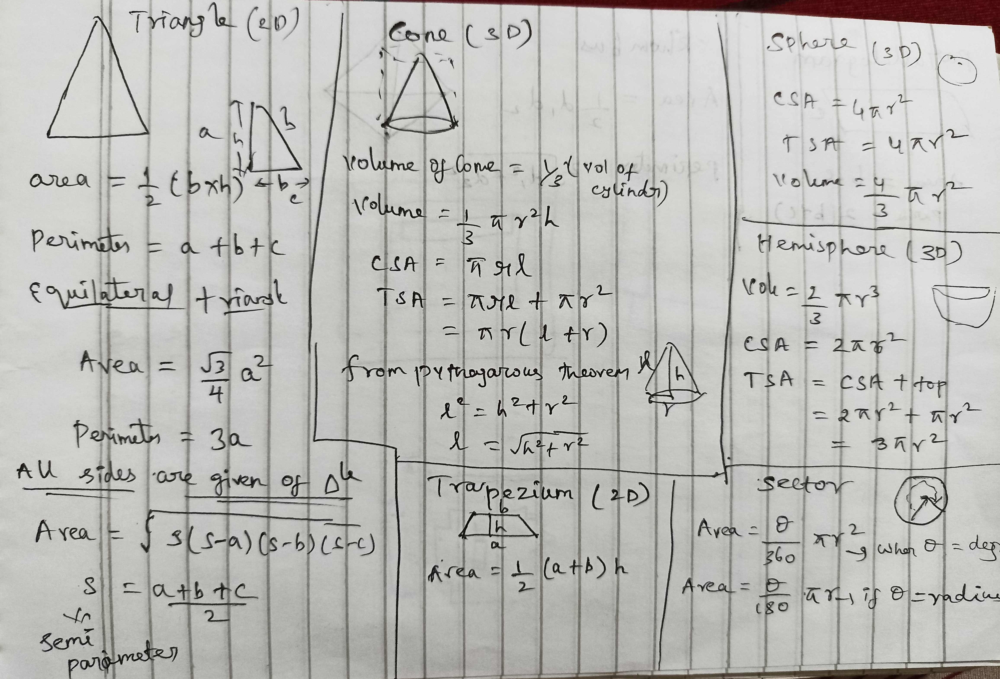
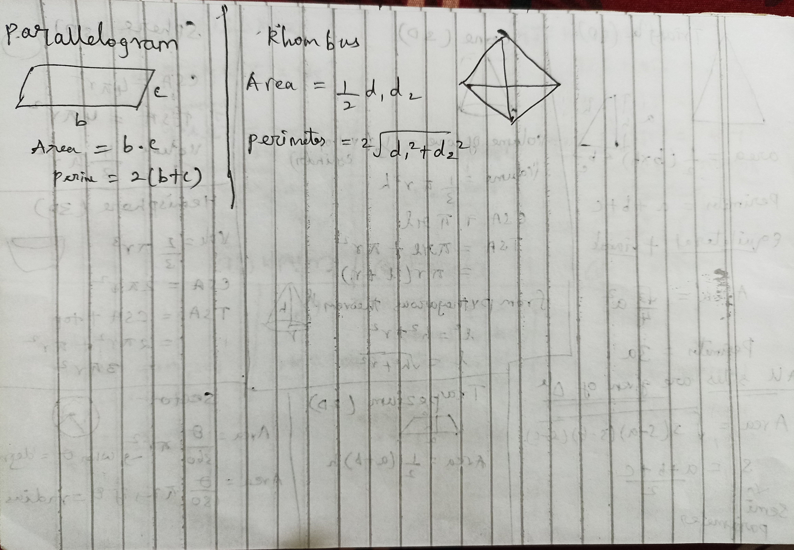

# Aptitude

# Percentages
-	A % B = (A* B) / 100    ( ex 20 % 0f 30 = 6 )
-	Always  A%B = B%A
## Percentages to fractions
1.	50% = 1/2,  33.33% = 1/3,  25% = 1/4,  20% = 1/5, 16.66% = 1/6, 12.5% = 1/8,  11.11% = 1/9.
2.	66.66% = 2/3 ,  40% = 2/5  ,  22.22% = 2/9.
3.	150% = 3/2 , 75% = 3/4 , 60% = 3/5 ,  37.5% = 3/8 , 30% = 3/10.
4.	13.33% = 4/3 , 80% = 4/5 , 44.44% = 4/9.
5.	83.33% = 5/6 ,  62.5% = 5/8 ,  55.55% = 5/9
6.	120% = 6/5 , 75% = 6/8 .
7.	77.77% = 7/9 , 70% = 7/10.
8.	88.88% = 8/9.
9.	90% = 9/10.
## Percentage Increase or Decrease
-	% Change (Increase 0r Decrease) = ( Difference Value  /  Initial or Compared value ) * 100.
-	When Initial  = = Final the then if  %increase = n/x then %decrease = n/x+1.
## Successive Percentage Change
-	Definition : 1st day incre or decre with that value 2nd day incre or decre is called successive change.
-	Overall % (Increase or Decrease) = a + b + (a*b)/100. Where a and b are the 1st and 2nd day values. Also +a or +b in case of increase and -a or -b in case of decrease.
- if there is three entities like a , b, c or and so on sole a,b and using the value solve result(a,b) and c

# Area , Volume and Mensuration
- Basic shapes and their respective areas, perimeter and volumes.

- In Rhombus d1 and d2 are size of two diagonals.

# Profit and Loss
- profit  p = (sp -cp)
- loss L = (cp-sp) 
- P% = (p/cp) * 100
- L% = (L/cp) * 100
- sp = overall(P or L) % * cp // overall means profit or loss if 10% profit means 100+10=110% overall and incase of  loss 100-10=90% will be the overall percentage. The formula can also be written as sp = (100+P%) * cp, sp = (100-L%) * cp.
- If sp1 = sp2 and P%=L%=x then loss in the whole transaction is  L = - (x^2) / 100. Here minus represents loss.
- If cp1 = cp2 and P%=L% then No profit and No Loss in the whole transaction.
- When cp of x items = sp of y items then P% or L% = ((x/y)-1) * 100
- Initial no of items = P or L -> equ 1 and how many items as x = cp. Cross multiply two equation to get x.
# Dicount and Profit & Loss
- change in Dicount amount = Change in Profit Or loss amount
- For Successive or continous  discounts like 10%,20%,30% and 40% is equal to the single discount of 56.8% use the formula a+b+((a*b)/100) -a or -b if it is discount +a or +b if it is increse in price . check out successine percentage formulas.
# Ratio
- Let the amount x is divided between a,b,c,.. so on memebers then  a = (a/a+b+c+...) * 100. Similarly for all the other individual findings.